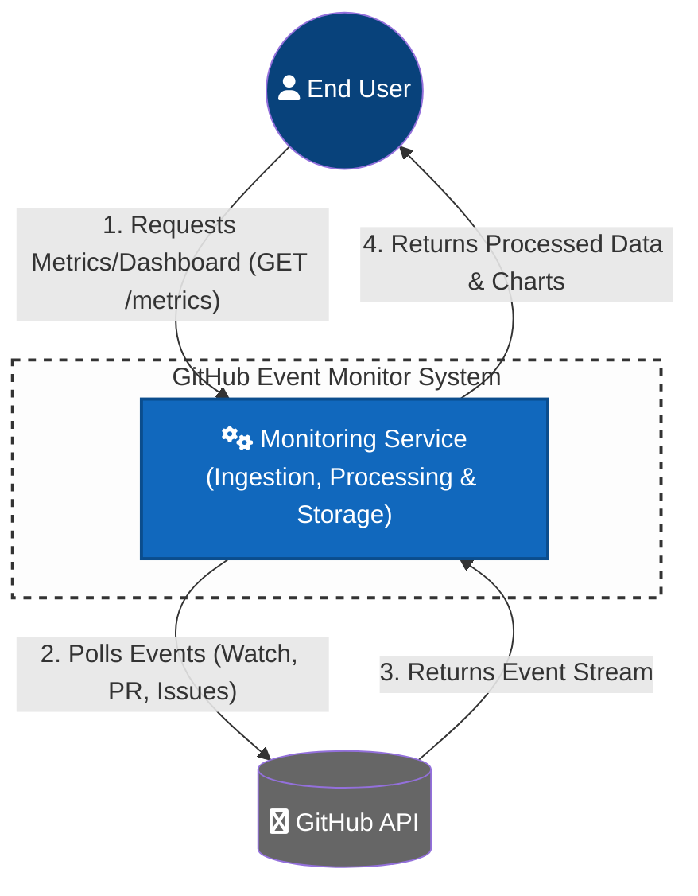

# GitHub Event Monitor

Streams GitHub events from the public event firehose and provides metrics via REST API.

The app is deployed at https://github-event-monitor.444424444.xyz

## Deployment

There are two ways to deploy this application using Docker Compose.

### Local Development

The provided `docker-compose.yml` is configured for local development. It will build the Docker image locally and mount the source code, allowing for hot-reloading.

```bash
docker-compose up --build
```

### Production Deployment (using pre-built image)

For production, it's recommended to use a pre-built Docker image from a container registry like GitHub Container Registry.

1.  **Create a `docker-compose.prod.yml` with `docker-compose.yml`, but change the app:**

```yaml
  app:
    image: ghcr.io/9motom6/github-events:latest
    container_name: github_monitor_app
```

2.  **Run Docker Compose:**

    ```bash
    docker-compose -f docker-compose.prod.yml up -d
    ```

## Main API Endpoints

- `GET /metrics/pr-stats/{owner}/{repo}` - Average time between PRs for a repo
- `GET /events-count?offset=10` - Event counts grouped by type for last N minutes
- `GET /metrics/dashboard` - Shows the distribution of events by type in a bar chart.

## Assumptions & Technical Decisions

- The app GitHub's public event API (https://api.github.com/events) which provides a sample of the last 300 events. This only provides a small  window (100 events per call) into the huge number of events happening at Github. The data we get is not complete.
- Polling Strategy: To stay within rate limits, the worker implements an adaptive polling interval based on the X-Poll-Interval header returned by GitHub (typically 60 seconds).
- Events are filtered to only WatchEvent, PullRequestEvent, and IssuesEvent
- We only call 1 page to not get blocked by GitHub, but with the max amount of events (100)
- The app needs to run for a while to get some nice data
- The app sets limits to the amount of stored data
- Precision: The Average PR Time is calculated as a rolling average to save O(1) space, rather than storing every single timestamp ever received.
- Running average formula: Use the formula: $NewAvg = \frac{(OldAvg \times Count) + NewDelta}{Count + 1}$

## C4 (level 1) Software system diagram


