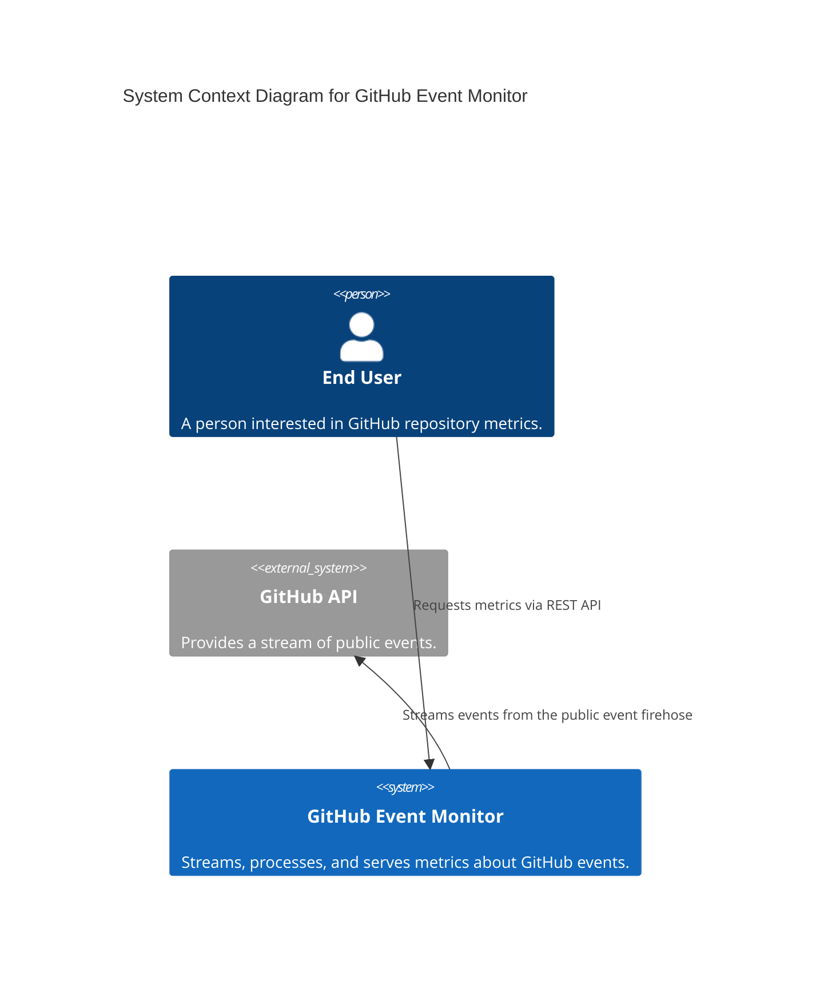

The task:

The aim of this assignment is to monitor activities happening on GitHub. For that we want you to stream specific events from the Github API (https://api.github.com/events). The events we are interested in are the WatchEvent, PullRequestEvent and IssuesEvent. Based on the collected events, metrics shall be provided at any time via a REST API to the end user. The following metrics should be implemented:  
- Calculate the average time between pull requests for a given repository.  
- Return the total number of events grouped by the event type for a given offset. The offset determines how much time we want to look back i.e., an offset of 10 means we count only the events which have been created in the last 10 minutes.   
- Bonus assignment: Add another REST API endpoint providing a meaningful visualization of one of existing metrics or a newly introduced metric.

 Please add a README file to your solution that contains how to run the solution and a brief description about your assumptions. To get an idea of your documentation skills, we ask you to create a simple diagram of your application preferably regarding the C4 (level 1) model rules (https://c4model.com/). The assignment will have to be made in Python. We expect it will take 8 hours to do it properly.

---

As a senior engineer, your goal is to demonstrate **architectural intent**, **operational safety**, and **clean abstractions**. You aren't just writing a script; you are building a data pipeline.

Here is a 6-phase execution plan designed to fit within the 8-hour window while hitting every "Senior" marker.

---

# 🚀 Project Execution Plan: GitHub Event Monitor

## Phase 1: Environment & Architecture (Hour 1)

* **Initialize with `uv**`: Run `uv init github-monitor` to set up the modern Python toolchain.
* **Dependency Selection**:
* `fastapi`, `uvicorn` (The API).
* `httpx` (Async HTTP client for the stream).
* `pydantic-settings` (For environment variable management like `GITHUB_TOKEN`).
* `redis` or `sqlmodel` (State management).

* **C4 Level 1 Diagram**: Draft the System Context diagram immediately. It forces you to define the boundaries between the User, your App, and the GitHub API.

---

## Phase 2: Domain Modeling & Schemas (Hour 2)

* **Pydantic Models**: Create strict schemas for the GitHub payload.
* *Why?* GitHub's JSON is deeply nested. You need to extract `type`, `repo.name`, and `created_at` reliably.

* **The State Contract**: Define an Interface (Protocol) for your `MetricsStore`. Whether you use Redis or In-Memory later, the API should only interact with this interface.

---

## Phase 3: The Resilient Streamer (Hours 3–4)

* **Implementation**: Build the `GithubStreamer` class we discussed.
* **Key Senior Features**:
* **ETag Support**: Prevent wasting rate limits on 304 responses.
* **Dynamic Backoff**: Respect the `X-Poll-Interval` header.
* **De-duplication**: Use an LRU cache or a bounded set for Event IDs.

* **Background Task**: Use FastAPI's `lifespan` events to start/stop the streamer loop when the server goes up/down.

---

## Phase 4: Metrics Engine & Storage (Hours 5–6)

* **The "Average PR Time" Logic**:
* Store `(last_pr_timestamp, rolling_average, count)` per repository.
* Use the formula: $NewAvg = \frac{(OldAvg \times Count) + NewDelta}{Count + 1}$ to keep storage constant.

* **The "Offset" Logic**:
* If using **Redis**: Use a Sorted Set (`ZSET`) where the score is the timestamp.
* If using **In-Memory**: Use a `collections.deque` for O(1) appends and pop-lefts.

* **Concurrency**: Ensure all writes are wrapped in an `asyncio.Lock` or handled via atomic Redis operations.

---

## Phase 5: REST API & Visualization (Hour 7)

* **Endpoints**:
* `GET /metrics/common`: Grouped counts by type + offset query param.
* `GET /metrics/pr-stats/{owner}/{repo}`: Average time between PRs.

* **Bonus (Visualization)**:
* Use **Jinaj2** and **Chart.js**. Create a simple `/viz` endpoint that renders a bar chart of the event distribution from the last 60 minutes. It's high-impact for very little code.

---

## Phase 6: Documentation & Polishing (Hour 8)

* **README**: This is your "Interview Speech." Include:
* **Assumptions**: Acknowledge the "sampling" nature of global polling.
* **Setup**: Use `uv run` commands.
* **Trade-offs**: Why you chose Redis/In-Memory over a heavy DB.

* **Refactoring**: Ensure variable naming is consistent and type hints are everywhere.

---

### Pro-Tip for the README

Include a "Future Improvements" section. Mention:

1. **Observability**: Adding Prometheus metrics for the streamer’s health.
2. **Scalability**: Moving from a single poller to a distributed worker model using Celery or Arq.
3. **Webhook Integration**: How this system would transition from Polling to Webhooks for specific "high-value" repos.

---

## 🏛️ C4 Model: Level 1 - System Context

This diagram shows the system's context, outlining the key actors and external systems it interacts with.

